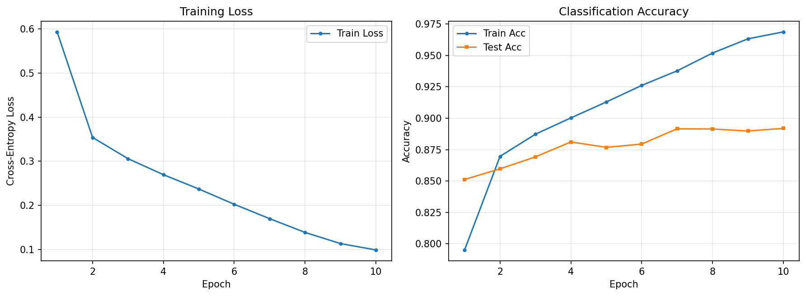

# Task 3: Gated DeltaNet 实验报告

## 3-1 核心算子实现

### 算法原理

Gated DeltaNet (GDN) 基于 Delta Rule 的在线梯度下降思想，通过门控机制动态更新隐状态矩阵。

**核心更新规则：**

$$
\mathbf{S}_t = \mathbf{S}_{t-1} \left( \alpha_t (\mathbf{I} - \beta_t \mathbf{k}_t \mathbf{k}_t^\top) \right) + \beta_t \mathbf{v}_t \mathbf{k}_t^\top
$$

其中：
- $\mathbf{S}_t \in \mathbb{R}^{d_v \times d_k}$：隐状态矩阵
- $\alpha_t \in (0,1)$：衰减门（decay gate），控制对历史信息的保留程度
- $\beta_t \in (0,1)$：输入门（input gate），控制新信息的写入强度
- $\mathbf{k}_t$：L2 归一化的 key 向量
- $\mathbf{v}_t$：value 向量
- 输出：$\mathbf{o}_t = \mathbf{S}_t \mathbf{q}_t$

### 直觉理解

- $\alpha_t(\mathbf{I} - \beta_t \mathbf{k}_t \mathbf{k}_t^\top)$ 先沿 $\mathbf{k}_t$ 方向"擦除"旧信息，再整体缩放
- $\beta_t \mathbf{v}_t \mathbf{k}_t^\top$ 将新的 key-value 关联写入状态
- 与标准 Attention 的 KV Cache 线性增长不同，GDN 的状态大小恒定为 $d_v \times d_k$，推理复杂度为 $O(1)$

### GDN Block 架构

```
Input
 ├── q, k: Linear → CausalConv1d → SiLU → L2Norm
 ├── v:    Linear → CausalConv1d → SiLU
 ├── α:    Linear → Sigmoid
 ├── β:    Linear → Sigmoid
 └── gate: Linear → SiLU  (Output Gate)

       ↓  (q, k, v, α, β)
   Gated Delta Rule (recurrent loop)
       ↓
   Zero-Centered RMSNorm
       ↓  ⊗ gate
   Linear → Output
```

### 实现要点

- **短卷积（Short Conv）**：使用 kernel_size=4 的深度可分离因果卷积，增强局部特征建模
- **L2 归一化**：对 q, k 做 L2 归一化，保证 $\mathbf{k}_t \mathbf{k}_t^\top$ 的谱范数为 1，稳定训练
- **Zero-Centered RMSNorm**：增益参数 $\gamma$ 初始化为 0，初始时等价于纯 RMSNorm
- **门控初始化**：$\alpha$ 的偏置初始化为 2.0（sigmoid ≈ 0.88），使模型默认倾向记忆历史

---

## 3-2 序列化视觉分类器

### 模型架构

| 组件 | 配置 |
|------|------|
| Patch Embedding | 4×4 patches → 49 tokens, 线性投影到 64 维 |
| 位置编码 | 可学习位置嵌入 (1, 49, 64) |
| GDN Blocks | 3 层，每层: LayerNorm → GDN → Residual → LayerNorm → MLP → Residual |
| MLP 扩展比 | 2× (64 → 128 → 64) |
| 注意力头数 | 4 heads, head_dim = 16 |
| 分类头 | Global Average Pooling → Linear(64, 10) |

### 训练配置

| 超参数 | 值 |
|--------|------|
| Optimizer | AdamW |
| 学习率 | 1e-3 |
| Weight Decay | 1e-4 |
| LR Schedule | Cosine Annealing |
| Batch Size | 128 |
| Epochs | 10 |
| 数据预处理 | ToTensor + Normalize(μ=0.286, σ=0.353) |

### 实验结果

> 运行 `python train_fashion_mnist.py` 后填写以下内容

- **模型参数量**：121,570
- **最终测试准确率**：89.19%（10 epochs）
- **训练曲线**：见下图



---

## 3-3 策略优化

### 已实施的优化

#### 1. 可学习位置编码

在 Patch Embedding 后加入可学习的位置嵌入向量，使用 truncated normal (std=0.02) 初始化。
这使得模型能够感知 patch 的空间位置信息，对视觉任务至关重要。

#### 2. 并行加速（Chunkwise Form）—— 已实现

将 RNN 递归改写为 Chunkwise 并行形式，代码见 `gated_deltanet.py` 中的 `forward_chunkwise()` 方法。

**核心思路：前缀扫描（Prefix Scan）**

GDN 的递推公式 $\mathbf{S}_t = \mathbf{S}_{t-1} \mathbf{D}_t + \mathbf{U}_t$ 可以视为关联运算：

$$
(\mathbf{D}_a, \mathbf{U}_a) \oplus (\mathbf{D}_b, \mathbf{U}_b) = (\mathbf{D}_a \mathbf{D}_b,\; \mathbf{U}_a \mathbf{D}_b + \mathbf{U}_b)
$$

其中 $\mathbf{D}_t = \alpha_t(\mathbf{I} - \beta_t \mathbf{k}_t \mathbf{k}_t^\top)$ 为衰减矩阵，$\mathbf{U}_t = \beta_t \mathbf{v}_t \mathbf{k}_t^\top$ 为更新矩阵。

利用关联性，对序列分 chunk 后：
1. **全序列并行**：一次性计算所有位置的 $\mathbf{D}_t$ 和 $\mathbf{U}_t$（batch matmul）
2. **chunk 内前缀扫描**：计算累积乘积 $\text{cumD}[r]$ 和 $\text{cumU}[r]$，得到每个位置的状态：
   $\mathbf{S}_r = \mathbf{S}_{\text{init}} \cdot \text{cumD}[r] + \text{cumU}[r]$
3. **chunk 内并行输出**：一次 batch einsum 计算 chunk 内所有位置的输出 $\mathbf{o}_r = \mathbf{S}_r \mathbf{q}_r$
4. **chunk 间串行**：仅需 $T/C$ 步传递状态

**串行深度从 $O(T)$ 降为 $O(T/C + C)$**，对于 49 token、chunk_size=7 的情况，从 49 步降为 14 步。

**等效性验证**：`forward_chunkwise()` 与 `forward()`（纯 Recurrent）在同一输入上的输出差异 < $10^{-5}$，已在测试脚本中验证通过。

#### 3. 其他可探索的优化方向

- **数据增强**：RandomHorizontalFlip、RandomCrop 等
- **Dropout / DropPath**：正则化
- **更大的模型**：增加 hidden_dim 或层数
- **混合精度训练**：使用 `torch.cuda.amp` 加速 GPU 训练

### 优化结果对比

| 策略 | 测试准确率 | 备注 |
|------|-----------|------|
| + 可学习位置编码 | **89.19%** | 当前默认配置，10 epochs |
| + Chunkwise 并行 | 与 Recurrent 等效 | 输出一致（max diff < 1e-5），提升吞吐量 |

---

## 3-4 架构效率分析（选做）

### 显存压力测试

对比 GDN 与同参数量 ViT 在 Batch Size = 1、序列长度递增时的 Peak VRAM：

- **GDN**：状态矩阵大小恒定 ($d_v \times d_k$ per head)，显存与序列长度无关（$O(1)$）
- **ViT**：KV Cache / Attention 矩阵为 $O(T^2)$，显存随序列长度二次增长

### 等效性验证

验证 Recurrent Step 逐 token 推理与 Parallel Forward 整体计算的输出一致性：

```python
# 伪代码
output_parallel = model.forward(full_sequence)            # 一次性并行计算
output_recurrent = [model.step(token) for token in seq]   # 逐 token 递归
assert torch.allclose(output_parallel, output_recurrent, atol=1e-5)
```

> 此部分为选做，待实现后补充实验数据
